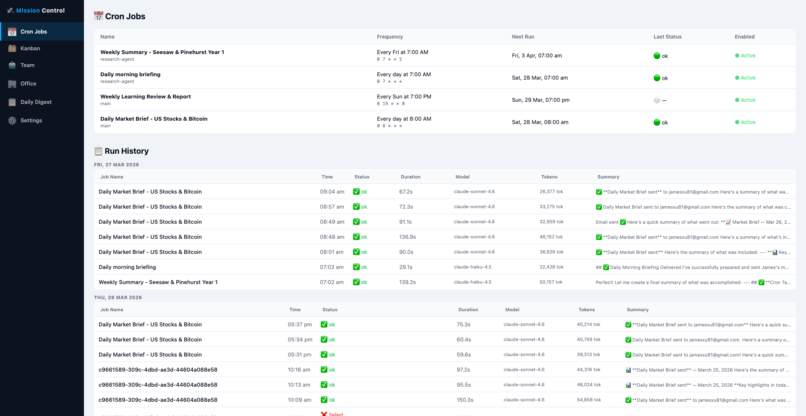
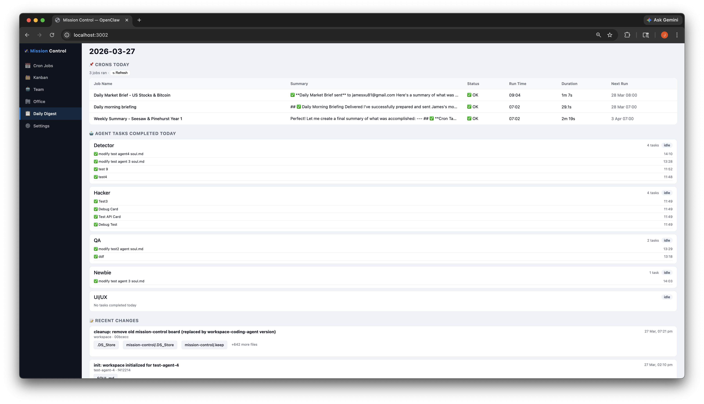
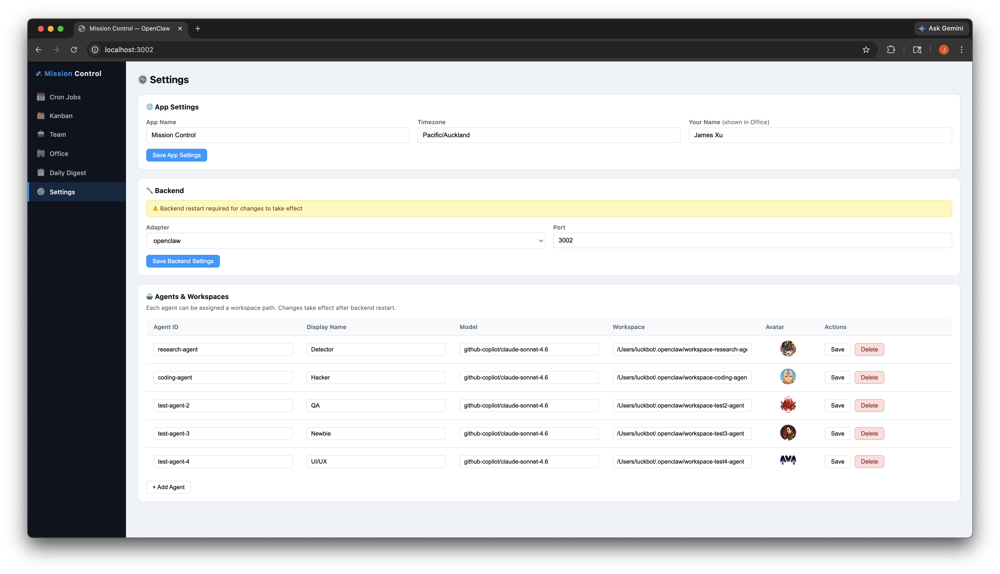

# 🛰 Mission Control Board

> **The command center for your AI agent team.** A self-hosted, real-time dashboard that lets you manage, monitor, and dispatch AI agents from a single beautiful interface.


🎥 Demo video: https://www.youtube.com/watch?v=K3SStxCWg6c

---

## ✨ Why Mission Control Board?

If you're running multiple AI agents — coding agents, research agents, or any custom LLM workers — keeping track of what they're doing, what they've done, and what's scheduled is chaos.

**Mission Control Board solves this:**

- 🧑‍💻 **Assign tasks** to specific agents from a Kanban board
- 📊 **Watch them work** with real-time status and execution logs
- 📅 **Monitor scheduled jobs** (cron) and their run history
- 🏢 **Visualize your team** in a beautifully designed office layout
- 📋 **Review daily activity** in a single unified digest
- ⚙️ **Configure everything** through a visual settings panel

Built on top of [OpenClaw](https://openclaw.ai), but designed to be extensible for any AI agent backend.

---

## 📸 Screenshots

### 📅 Cron Jobs — Schedule & Monitor Automation



See all your scheduled automation jobs at a glance. Each job shows its schedule, last status, run history, duration, tokens used, and a summary of what the agent did. Drill into individual runs to see exactly what happened.

---

### 🗂 Kanban Board — Assign Tasks to Agents


Create task cards and assign them to any agent on your team. Hit **Run** to dispatch a task — the agent picks it up, executes it, and the card moves automatically from **To Do → Doing → Done**. Every execution logs its output directly on the card.

---

### 🤖 Team — Active Agent Status


See every agent's current status (idle/running), their task history, and execution logs. Know exactly what each agent has done today, with timestamps and log counts.

---

### 🏢 Office — Live Agent Visualisation


A uniquely fun view: your AI team as an office floor plan. Each agent has their own desk, avatar, and live status indicator. When an agent is running a task, their desk lights up. The director (you) sits in the corner office upstairs.

---

### 📋 Daily Digest — Everything That Happened Today



A daily rollup showing every cron job that ran today, every agent task completed, and what each one did. Perfect for a morning review or end-of-day summary.

---

### ⚙️ Settings — Visual Config Editor



Configure your entire setup through the UI. Add or remove agents, set their models and workspace paths, upload custom avatars, change the app name, timezone, and backend adapter — all without touching a config file.

---

## 🚀 Quick Start

**Prerequisites:** Node.js 18+, [OpenClaw](https://openclaw.ai) installed

```bash
# Clone the repo
git clone https://github.com/your-username/mission-control-board
cd mission-control-board

# Install dependencies
npm install

# Copy and edit config
cp config.example.json config.json
# Edit config.json: set your openclaw paths, agent list, port

# Start
npm start
```

Open **http://localhost:3001** in your browser.

---

## 🐳 Docker

```bash
docker compose up -d
```

Access at **http://localhost:3001**

---

## ⚙️ Configuration

Copy `config.example.json` → `config.json` and edit:

```json
{
  "app": {
    "name": "Mission Control",
    "timezone": "America/New_York",
    "ownerName": "Your Name"
  },
  "backend": {
    "port": 3001,
    "adapter": "openclaw"
  },
  "adapter": {
    "openclaw": {
      "binPath": "/opt/homebrew/bin/openclaw",
      "cronDir": "/path/to/.openclaw/cron",
      "workspaceRoot": "/path/to/.openclaw"
    }
  }
}
```

> **Note:** `config.json` and `data/data.json` are gitignored. Your personal settings stay local.
> Agent data is auto-synced from your OpenClaw config at startup.

---

## 🔌 Adapters

| Adapter | Description |
|---------|-------------|
| `openclaw` | Full integration with OpenClaw — reads cron jobs, spawns agents, tracks git changes |

The REST adapter scaffold is included for future custom backends.

---

## 🏗 Architecture

```
mission-control-board/
├── backend/
│   ├── index.js          # Express API server
│   ├── sync.js           # Data initialization
│   └── adapters/
│       ├── openclaw.js   # OpenClaw integration
│       └── rest.js       # Generic REST (scaffold)
├── frontend/
│   └── index.html        # Single-page app (vanilla JS)
├── data/                 # Auto-generated runtime data
└── config.json           # Your local config (gitignored)
```

**Frontend:** Pure vanilla HTML/CSS/JS — no build step, no framework, no complexity.  
**Backend:** ~400 lines of Express.js — easy to read, easy to extend.

---

## 📦 What's Included

- ✅ Kanban board with agent dispatch + real-time logs
- ✅ Cron job scheduler view + full run history
- ✅ Team dashboard with agent status tracking
- ✅ Office floor plan with live status visualisation
- ✅ Daily digest summary
- ✅ Visual config editor (agents, workspaces, models, avatars)
- ✅ Auto git-init for new agent workspaces
- ✅ Recent Changes (git diff viewer across all workspaces)
- ✅ Docker + docker-compose support
- ✅ Auto-restart on failure (via launchctl/systemd)

---

## 🤝 Contributing

Pull requests welcome. For major changes, open an issue first.

---

## 📄 License

MIT
